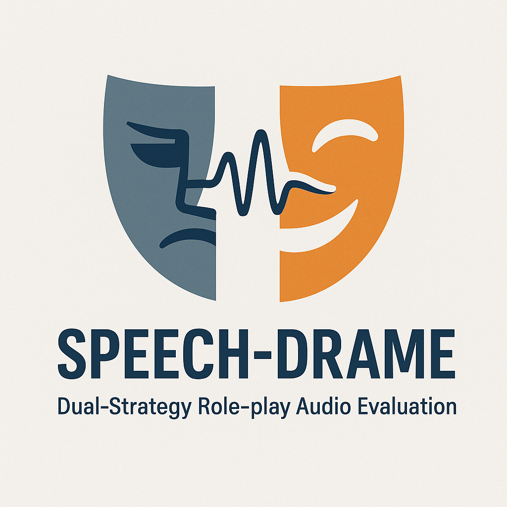
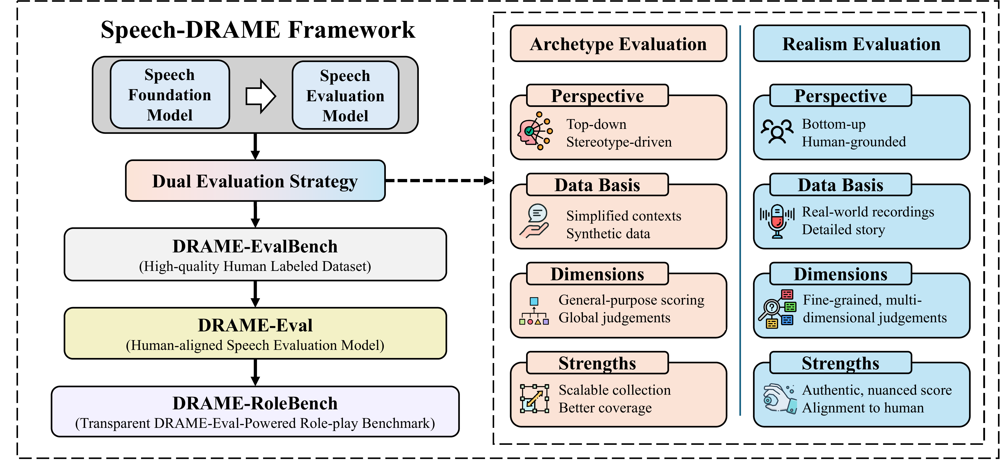

<div align="center">
  
  <h1 style="display: inline-block; margin: 0;">Speech-DRAME: A Framework for Human-Aligned Benchmarks in Speech Role-Play</h1>
  
  <br><br>
  
</div>

[](https://opensource.org/licenses/Apache-2.0)
[](https://arxiv.org/abs/2511.01261)


**Speech-DRAME** introduces a unified framework for evaluating AI-generated speech in role-playing scenarios, addressing the critical gap in speech role-play evaluation through human-aligned benchmarks and specialized evaluation models.

## 📖 Abstract

Role-play has become a key testbed for generative models, expanding from text-only dialogue to multimodal interaction. Extending role-play to speech captures prosody, emotion, and delivery, but also poses new evaluation challenges. Current pipelines often use audio large language models (ALLMs) as zero-shot judges, which miss paralinguistic cues, collapse multiple aspects into coarse scores, and rely on synthetic speech references that fail to reflect real-world roles.

We present **Speech-DRAME**, a unified framework that contributes at three levels: (i) **Speech-DRAME-EvalBench**, an evaluation benchmark with bilingual human-annotated data and protocols for training and testing speech evaluation models (SEMs), (ii) **DRAME-Eval**, a fine-tuned evaluation model that substantially outperforms zero-shot and few-shot ALLMs, and (iii) **Speech-DRAME-RoleBench**, a speech role-play benchmark that leverages DRAME-Eval as an automatic judge to compare speech foundation models (SFMs).

## 🎯 Key Contributions

### 1. **Dual Evaluation Paradigm**
Speech-DRAME distinguishes between two complementary evaluation strategies:
- **🎪 Archetype Evaluation**: A top-down approach measuring adherence to broad role archetypes
- **🎭 Realism Evaluation**: A bottom-up approach grounded in real human speech that emphasizes nuanced role quality

### 2. **Human-Aligned Performance**
Compared to zero-shot ALLM judges, DRAME-Eval achieves stronger agreement with human ratings:
- **Archetype Evaluation**: Pearson correlation improves from 0.480 to 0.629
- **Realism Evaluation**: Pearson correlation improves from 0.390 to 0.625

### 3. **Comprehensive Framework**
- **Multi-Modal Evaluation**: Combines audio and text analysis for comprehensive speech assessment
- **Bilingual Support**: English and Chinese evaluation capabilities
- **Multiple Approaches**: Supports zero-shot, few-shot, and fine-tuning evaluation methods
- **Reproducible Benchmarks**: Transparent benchmark resources and evaluation protocols

## 🏗️ Framework Components

<div align="center">
  
  <p><em>Speech-DRAME Framework Architecture and Components</em></p>
</div>

Speech-DRAME consists of three main components that work together to provide comprehensive speech role-play evaluation:

### 1. **Speech-DRAME-EvalBench**
A comprehensive evaluation benchmark featuring:
- **Bilingual Human-Annotated Data**: High-quality English and Chinese datasets with detailed annotations
- **Training Protocols**: Standardized procedures for training speech evaluation models
- **Testing Protocols**: Rigorous evaluation procedures for model assessment
- **Quality Control**: Multiple annotator validation and inter-annotator agreement measures

### 2. **DRAME-Eval**
A specialized fine-tuned evaluation model that:
- **Outperforms Zero-shot ALLMs**: Achieves significantly better human alignment than general-purpose models
- **Handles Both Paradigms**: Supports both archetype and realism evaluation approaches
- **Scalable Inference**: Enables efficient evaluation of large-scale speech generation systems
- **Bilingual Capability**: Processes both English and Chinese speech role-play scenarios

### 3. **Speech-DRAME-RoleBench**
A systematic benchmark for comparing speech foundation models:
- **Automated Evaluation**: Uses DRAME-Eval as an automatic judge for consistent assessment
- **Model Comparison**: Enables fair comparison across different speech foundation models
- **Standardized Metrics**: Provides consistent evaluation criteria across different models
- **Reproducible Results**: Ensures reproducible and comparable evaluation outcomes

## 📁 Project Structure

```
speech_drame/
├── zeroshot/          # Zero-shot evaluation framework
│   ├── models/        # Audio LLM implementations
│   ├── prompts/       # Evaluation prompts and schemas
│   ├── pyscripts/     # Evaluation and scoring scripts
│   └── scripts/       # Shell scripts for batch evaluation
├── fewshot/           # Few-shot evaluation framework
│   ├── models/        # Audio LLM implementations
│   ├── prompts/       # Evaluation prompts and schemas
│   ├── pyscripts/     # Evaluation and scoring scripts
│   └── scripts/       # Shell scripts for batch evaluation
├── finetuning/        # Fine-tuning framework
│   ├── src/           # Training and testing source code
│   ├── conf/          # Configuration files
│   └── scripts/       # Training and evaluation scripts
└── data/              # Evaluation datasets
    ├── archetype_data/ # Character archetype evaluation data
    └── realism_data/   # Realism evaluation data
```

## 🚀 Quick Start

### Prerequisites

- Python 3.8+
- CUDA-compatible GPU (recommended for fine-tuning)
- Conda environment manager

### Installation

1. **Clone the repository**
   ```bash
   git clone <repository-url>
   cd speech_drame
   ```

2. **Set up environment**
   ```bash
   conda create -n speech_drama python=3.8
   conda activate speech_drama
   pip install -r requirements.txt
   ```

3. **Configure API keys** (for cloud-based models)
   ```bash
   export OPENAI_API_KEY="your-openai-key"
   export GOOGLE_API_KEY="your-google-key"
   # Add other API keys as needed
   ```

### Basic Usage

#### Realism Evaluation (Zero-shot)
```bash
cd zeroshot
python pyscripts/eval.py \
    --model_name gemini25 \
    --data_path ../data/realism_data/test.jsonl \
    --output_path realism_results.jsonl \
    --prompt_type combined
```

#### Archetype Evaluation (Zero-shot)
```bash
cd zeroshot
python pyscripts/eval.py \
    --model_name gemini25 \
    --data_path ../data/archetype_data/test.jsonl \
    --output_path archetype_results.jsonl \
    --prompt_type archetype_combined
```

#### Few-shot Evaluation
```bash
cd fewshot
# For realism evaluation
python pyscripts/eval.py \
    --model_name gpt4o \
    --data_path ../data/realism_data/test.jsonl \
    --output_path fewshot_realism_results.jsonl \
    --prompt_type combined

# For archetype evaluation
python pyscripts/eval.py \
    --model_name gpt4o \
    --data_path ../data/archetype_data/test.jsonl \
    --output_path fewshot_archetype_results.jsonl \
    --prompt_type archetype_combined
```

#### Fine-tuning
```bash
cd finetuning
# Train for realism evaluation
bash run_realism_train.sh

# Train for archetype evaluation  
bash run_archetype_train.sh

# Or use Python directly
python src/train_sft.py \
    --model_name_or_path Qwen/Qwen2-Audio-7B-Instruct \
    --data_file ../data/realism_train_data.jsonl \
    --output_dir exp/realism_sft_model
```

## 🔜 Upcoming Releases

The following resources will be released in upcoming updates:

- **Pre-trained Model**: The DRAME-Eval model weights will be made available for direct use
- **Inference Pipeline**: Ready-to-use inference scripts with the pre-trained model for easy evaluation
- **Dataset Samples**: Sample datasets will be released for research purposes

Stay tuned for updates!

## 📊 Evaluation Methodology

Speech-DRAME introduces a novel dual evaluation paradigm that addresses the limitations of existing speech role-play evaluation approaches. The framework combines two complementary strategies that capture different aspects of speech role-play quality.

### 🎭 **Realism Evaluation (Bottom-up Approach)**
Grounded in real human speech patterns, this approach emphasizes nuanced role quality and narrative consistency. The evaluation focuses on how well generated speech captures the subtle characteristics of authentic human role-play.

**11-Dimensional Rubric:**
| Metric | Description | Research Rationale |
|--------|-------------|-------------------|
| **Pitch Dynamics** | Variety and appropriateness of pitch contours | Captures prosodic variation essential for emotional expression |
| **Rhythmic Naturalness** | Flow, timing, absence of awkward pauses | Measures temporal coherence in speech delivery |
| **Stress Emphasis** | Clarity and correctness of syllable/word emphasis | Evaluates linguistic stress patterns for meaning conveyance |
| **Emotion Accuracy** | Does expressed emotion match intended label? | Assesses emotional alignment with character context |
| **Emotion Intensity** | Strength of expressed emotion | Measures emotional expressiveness and authenticity |
| **Emotional Dynamic Range** | Variation of emotion over the utterance | Captures emotional complexity and development |
| **Voice Identity Matching** | Matches speaker's known vocal identity/timbre | Evaluates consistency with character voice characteristics |
| **Trait Embodiment** | Presence of profile traits (positive or opposite) | Measures character trait expression in speech |
| **Local Scene Fit** | Speech content & tone suit the immediate scene | Assesses contextual appropriateness |
| **Global Story Fit** | Consistent with overarching story/speaker profile | Evaluates narrative coherence and character consistency |
| **Semantic Matchness** | Spoken content perfectly advances the scene goal | Measures functional effectiveness of speech content |

### 🎪 **Archetype Evaluation (Top-down Approach)**
This approach measures adherence to broad role archetypes, focusing on role-playing accuracy and basic performance criteria. It provides a more structured evaluation of fundamental role-play capabilities.

**4-Dimensional Rubric:**
| Metric | Description | Research Rationale |
|--------|-------------|-------------------|
| **Content Pass** | Binary pass/fail for basic requirements (length, relevance, language) | Ensures minimum quality standards for evaluation validity |
| **Audio Quality** | Technical quality assessment (artifacts, glitches) | Separates technical quality from content evaluation |
| **Human Likeness** | Context-free naturalness of speech delivery | Measures fundamental speech naturalness independent of role |
| **Appropriateness** | Context-dependent fit to role and scene requirements | Evaluates role-specific appropriateness and adherence |

### 🔬 **Methodological Innovation**

**Dual Paradigm Benefits:**
- **Complementary Coverage**: Top-down and bottom-up approaches capture different evaluation dimensions
- **Human Alignment**: Both paradigms are validated against human judgments with improved correlation
- **Bilingual Support**: Framework supports both English and Chinese evaluation scenarios
- **Scalable Evaluation**: Enables efficient assessment of speech foundation models at scale

## 📈 Research Results

### **Human Alignment Performance**
Our evaluation model, DRAME-Eval, demonstrates significant improvements over zero-shot audio LLM judges:

| Evaluation Type | Zero-shot ALLM | DRAME-Eval | Improvement |
|----------------|----------------|------------|-------------|
| **Archetype** | 0.480 | **0.629** | +31.0% |
| **Realism** | 0.390 | **0.625** | +60.3% |

*Pearson correlation with human ratings*

### **Key Findings**
1. **Specialized Models Outperform General LLMs**: Fine-tuned evaluation models achieve substantially better human alignment than zero-shot approaches
2. **Dual Paradigm Effectiveness**: Both archetype and realism evaluation provide complementary insights into speech role-play quality
3. **Bilingual Capability**: Framework successfully handles both English and Chinese speech role-play scenarios
4. **Scalable Evaluation**: DRAME-Eval enables efficient assessment of speech foundation models without human annotation

### **Benchmark Contributions**
- **Speech-DRAME-EvalBench**: First comprehensive benchmark for training speech evaluation models
- **Speech-DRAME-RoleBench**: Systematic comparison framework for speech foundation models
- **Human-Annotated Data**: High-quality bilingual datasets with detailed evaluation criteria

## 📁 Data Formats

### Realism Evaluation Data
**Input Format:**
```json
{
  "id": "role-eval_v1_0000",
  "local_scene": "Character description and scene context",
  "char_age": "Adult",
  "char_style": "Playful, Charismatic, Confident",
  "char_profile": "Detailed character background",
  "transcript": "Spoken text content",
  "wav_path": "path/to/audio/file.wav",
  "annotations": {
    "pitch_variation": [5, 3, 4, 5, 5, 5],
    "rhythmic_naturalness": [5, 4, 4, 5, 2, 5],
    "emotion_accuracy": [4, 4, 4, 5, 5, 4],
    "trait_embodiment": [5, 5, 5, 4, 5, 5]
  }
}
```

**Output Format:**
```json
{
  "id": "role-eval_v1_0000",
  "model_name": "gemini25",
  "response": "{\"pitch_dynamics\": 4.0, \"rhythmic_naturalness\": 3.0, \"emotion_accuracy\": 4.0, ...}",
  "audio_path": "path/to/audio/file.wav"
}
```

### Archetype Evaluation Data
**Input Format:**
```json
{
  "id": "250814_zh_SocialIdentity_0051",
  "question": "你是拖延症患者。朋友询问你之前答应帮忙做的一件事进展如何。你说：",
  "wav_path": "path/to/audio/file.wav",
  "annotations": {
    "content_pass": [true, true, true, true, true, true],
    "audio_quality": [4, 5, 4, 4, 4, 4],
    "human_likeness": [3, 4, 3, 4, 4, 4],
    "appropriateness": [4, 4, 4, 4, 5, 5]
  }
}
```

**Output Format:**
```json
{
  "id": "250814_zh_SocialIdentity_0051",
  "model_name": "gemini25",
  "response": "{\"content_pass\": true, \"audio_quality\": 4, \"human_likeness\": 3, \"appropriateness\": 4}",
  "audio_path": "path/to/audio/file.wav"
}
```

## 🤖 Supported Models

### Zero-shot & Few-shot
- **GPT-4o** - OpenAI's multimodal model
- **Gemini 2.5 Pro** - Google's advanced multimodal model
- **Qwen2.5 Omni** - Alibaba's multimodal model
- **Kimi Audio** - Moonshot's audio model
- **Qwen2 Audio** - Alibaba's audio-specialized model

### Fine-tuning
- **Qwen2-Audio-7B-Instruct** - Primary base model for fine-tuning
- Support for LoRA, QLoRA, and other PEFT methods

## 📈 Results Analysis

The framework provides comprehensive analysis tools for both evaluation types:

### Realism Evaluation Analysis
```bash
# Generate average scores across trials
python pyscripts/score_avg.py --input_dir results/realism/ --output_file realism_analysis.json

# Analyze individual dimensions
python pyscripts/score.py --input_dir results/realism/ --output_file realism_scores.json
```

### Archetype Evaluation Analysis
```bash
# Analyze archetype-specific performance
python pyscripts/arche_score.py --input_dir results/archetype/ --output_file archetype_analysis.json

# Generate archetype average scores
python pyscripts/arche_score_avg.py --input_dir results/archetype/ --output_file archetype_avg.json
```

### Batch Analysis Scripts
```bash
# Realism evaluation analysis
bash scripts/score_analysis.sh

# Archetype evaluation analysis
bash scripts/score_analysis_arche.sh
```

## 🔧 Configuration

### Model Configuration
Models are configured through YAML files in the `conf/` directory:

```yaml
training:
  model_name_or_path: "Qwen/Qwen2-Audio-7B-Instruct"
  num_train_epochs: 2
  learning_rate: 0.00005
  per_device_train_batch_size: 4
```

### Evaluation Configuration
Evaluation parameters can be customized through command-line arguments or configuration files.

## 📚 Documentation

- [Zero-shot Evaluation Guide](zeroshot/README.md)
- [Few-shot Evaluation Guide](fewshot/README.md)
- [Fine-tuning Guide](finetuning/README.md)
- [API Reference](PROJECT_STRUCTURE.md)

## 📄 License

Copyright 2025 Anuttacon

Licensed under the Apache License, Version 2.0 (the "License");
you may not use this file except in compliance with the License.
You may obtain a copy of the License at

    http://www.apache.org/licenses/LICENSE-2.0

Unless required by applicable law or agreed to in writing, software
distributed under the License is distributed on an "AS IS" BASIS,
WITHOUT WARRANTIES OR CONDITIONS OF ANY KIND, either express or implied.
See the License for the specific language governing permissions and
limitations under the License.

## 📚 Citation

If you use Speech-DRAME in your research, please cite our paper:

```bibtex
@inproceedings{shi2025speech,
  title={Speech-DRAME: A Framework for Human-Aligned Benchmarks in Speech Role-Play},
  author={Shi, Jiatong and Han, Jionghao and Lu, Yichen and Pascual, Santiago and Wu, Pengfei and Cui, Chenye and Watanabe, Shinji and Weng, Chao and Zhou, Cong},
  booktitle={ArXiv PrePrint},
  url={https://arxiv.org/abs/2511.01261}, 
  year={2026},
}
```

## 🙏 Acknowledgments

We thank the following organizations and communities for their contributions:
- **Qwen, KimiAudio, GLM** for providing the base audio models
- **OpenAI, Google** for API access to their multimodal models
- **Hugging Face** for hosting and distributing the evaluation datasets
- **The open-source community** for various tools and libraries that made this work possible
- **Human annotators** who contributed to the bilingual evaluation datasets

## 📞 Support

For questions and support:
- Create an issue in the repository
- Contact the development team (jiatong.shi@anuttacon.com or cong.zhou@anuttacon.com)
- Check the documentation in each module's README

---

**Note**: This project is actively maintained. Please check for updates regularly and report any issues you encounter.